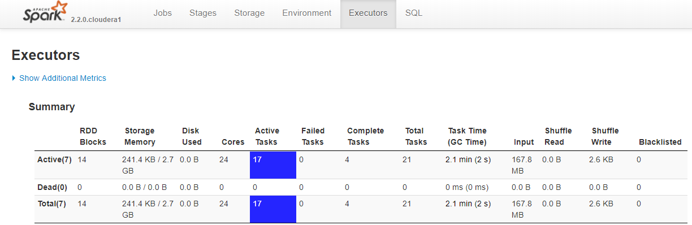

#Contract Registry App

## Developing the application
Most of the work is based on repeating patterns from previous excercises.
<br />
_Notable changes or new features:_

### Getting program arguments and constant values from configuration
```scala
package cz.kb.bd.contractregistry

import com.typesafe.config.{ ConfigFactory, Config }
import scala.util.Properties
import org.apache.log4j.{ LogManager, Logger, Level }

/**
 * Checks for argument values in environment variables and configuration file.
 */
object ConfigParser {

  private[this] val log: Logger = LogManager.getRootLogger
  private[this] val config: Config = ConfigFactory.load()

  /**
   * Checks for argument in environment variables and configuration file.
   * If found in environment variable, configuration will not be searched for this argument.
   * For environment variable dots are replaced with underscores
   *
   * @param argumentName name of argument to be returned
   * @param validationRegex optional Regex to validate argument value
   */
  def getArgumentStringValue(argumentName: String, validationRegex: String = ""): String = {
    val argValue: String = Properties.envOrElse(argumentName.toUpperCase.replaceAll("""\.""", "_"), config.getString(argumentName))
    if (validationRegex != "") {
      if (!argValue.matches(validationRegex))
        throw new IllegalStateException(s"Argument validation failed. Argument ${argumentName} with value: ${argValue} did not meet regex: ${validationRegex}")
    }
    log.debug(s"ARGUMENT NAME: ${argumentName}, ARGUMENT VALUE: ${argValue}")
    return argValue
  }

  /**
   * Checks for argument in environment variables and configuration file.
   * If found in environment variable, configuration will not be searched for this argument.
   * @param argumentName name of argument to be returned
   */
  def getArgumentIntValue(argumentName: String): Int = {
    getArgumentStringValue(argumentName).toInt
  }

  /**
   * Checks for argument in environment variables and configuration file.
   * If found in environment variable, configuration will not be searched for this argument.
   * @param argumentName name of argument to be returned
   */
  def getArgumentBooleanValue(argumentName: String): Boolean = {
    getArgumentStringValue(argumentName).toBoolean
  }

}
```

### Adding support for HDFS
```scala
private[this] val hadoopFS: FileSystem = FileSystem.get(SparkSession.builder.getOrCreate.sparkContext.hadoopConfiguration)

...

  /**
   * Download source document to target.
   * IF HDFS is configured, this method will also upload data to HDFS.
   *
   * @param source Source URL
   * @param target Target on local FS and or HDFS
   */
  def downloadFile(source: String, target: String): Unit = {
    require(source != "", "source can`t be empty")
    require(target != "", "target can`t be empty")

    log.info(s"processing download from: ${source}")
    try {
      val url = new URL(source)
      val file = new File(target)
      if (!file.exists()) {
        FileUtils.copyURLToFile(url, file)
        log.info(s"downloaded file from ${source} to ${target}")
      } else {
        log.info(s"skipped download of: ${source} because it exists")
      }
    } catch {
      case _: Throwable => log.warn(s"download failed for URL: ${source}")
    }
    if (USING_HDFS) {
      try {
      if (!hadoopFS.exists(new Path(target))) {
        if (new File(target).exists()) {
          hadoopFS.moveFromLocalFile(new Path(target), new Path(target))
          log.info(s"uploaded ${target} to hdfs")
        } else {
          log.warn(s"Could not upload ${target} to hdfs, because it does not exist locally.")
        }
      }
      } catch {
        case _: Throwable => log.warn(s"moving to HDFS failed for file: ${target}")
      }
    }
  }
```

### Parsing XML into Dataframe
```scala

...

val rawData = spark
	.read
	.format("com.databricks.spark.xml")
	.option("rowTag", "zaznam")
	.option("mode", "PERMISSIVE")
	.option("charset", charset)
	.option("ignoreSurroundingSpaces", true)
	.load(xmlSource)
	
...

```

### Writing parsed XML Dataframe to disk
```scala
private def writeDataFrameAsParquet(df: Dataset[Row], path: String, numPartitions : Int = 1) : Unit = {
	try {
		df
			.repartition(numPartitions)
			.write
			.mode(SaveMode.Overwrite)
			.option("compression.codec", PARQUET_COMPRESSION_CODEC)
			.parquet(path)
	} catch {
		case _: Throwable => s"an error occured while writing Parquet"
	}
}	
```


## Running app on cluster via spark-submit
_More about Spark Submit:_ https://www.cloudera.com/documentation/enterprise/5-13-x/topics/cdh_ig_running_spark_apps.html
<br />
```sh
spark2-submit --class cz.kb.bd.contractregistry.App ./ContractRegistryDownloader-1.0-SNAPSHOT-jar-with-dependencies.jar
```
To tune performance, you can use:
```
--num-executors NUM         Number of executors to launch (Default: 2).
                            If dynamic allocation is enabled, the initial number of
                            executors will be at least NUM.

--executor-cores NUM        Number of cores per executor. (Default: 1 in YARN mode,
                            or all available cores on the worker in standalone mode)
							
--driver-cores NUM          Cores for driver (Default: 1).

--executor-memory MEM       Memory per executor (e.g. 1000M, 2G) (Default: 1G).

--driver-memory MEM         Memory for driver (e.g. 1000M, 2G) (Default: 1024M).

```

Monitoring Spark job via backend


## Creating Metastore tables

### With parquet tables
```sql
--change parquet anme and paths according to your case
create external table stg_attachments like parquet "/user/Jakub.Augustin/data/tbl-attachments/part-00000-14cde4df-58be-4b6c-8156-a4c5c89813f3-c000.snappy.parquet"
stored as parquet
location "/user/Jakub.Augustin/data/tbl-attachments/";

compute stats stg_attachments;
show table stats stg_attachments;
show column stats stg_attachments;

--change parquet anme and paths according to your case
create external table stg_registry like parquet "/user/Jakub.Augustin/data/tbl-registry/part-00000-c059689b-9a06-4d9e-b6ee-e7885daaabf6-c000.snappy.parquet"
stored as parquet
location "/user/Jakub.Augustin/data/tbl-registry/";

compute stats stg_registry;
show table stats stg_registry;
show column stats stg_registry;

--change parquet anme and paths according to your case
create external table stg_contract_party like parquet "/user/Jakub.Augustin/data/tbl-contract-party/part-00000-f4bf53af-e4dd-42e8-9522-5cb213e828d0-c000.snappy.parquet"
stored as parquet
location "/user/Jakub.Augustin/data/tbl-contract-party/";

compute stats stg_contract_party;
show table stats stg_contract_party;
show column stats stg_contract_party;

```

### With CSV tables

```sql
CREATE EXTERNAL TABLE stg_attachments (   
	idsmlouvy BIGINT  
	, idverze BIGINT 
	, _value STRING
	, _algoritmus STRING
	, nazevsouboru STRING
	, odkaz STRING)
	ROW FORMAT DELIMITED
	FIELDS TERMINATED BY "~"
	STORED AS TEXTFILE 
	LOCATION 'hdfs://nameservice1/user/Jakub.Augustin/data/tbl-attachments'
	TBLPROPERTIES("skip.header.line.count"="1");
	
compute stats stg_attachments;
show table stats stg_attachments;
show column stats stg_attachments;

CREATE EXTERNAL TABLE stg_registry (   
	caszverejneni STRING 
	,   idsmlouvy BIGINT 
	,   idverze BIGINT 
	,   odkaz STRING 
	,   platnyzaznam BIGINT 
	,   cislosmlouvy STRING 
	,   hodnota DOUBLE 
	,   mena STRING 
	,   datumuzavreni STRING 
	,   hodnotabezdph DOUBLE 
	,   hodnotavcetnedph DOUBLE 
	,   navazanyzaznam BIGINT 
	,   predmet STRING 
	,   schvalil STRING 
	,   adresa STRING 
	,   datovaschranka STRING 
	,   ico STRING 
	,   nazev STRING 
	,   platce BIGINT 
	,   utvar STRING  ) 
	ROW FORMAT DELIMITED
	FIELDS TERMINATED BY "~"
	STORED AS TEXTFILE 
	LOCATION 'hdfs://nameservice1/user/Jakub.Augustin/data/tbl-registry'
	TBLPROPERTIES("skip.header.line.count"="1");

compute stats stg_registry;
show table stats stg_registry;
show column stats stg_registry;

CREATE EXTERNAL TABLE stg_contract_party (
	idsmlouvy BIGINT 
	,   idverze BIGINT 
	,   adresa STRING 
	,   datovaschranka STRING 
	,   ico STRING 
	,   nazev STRING 
	,   prijemce BIGINT 
	,   utvar STRING  ) 
	ROW FORMAT DELIMITED
	FIELDS TERMINATED BY "~"
	STORED AS TEXTFILE  
	LOCATION 'hdfs://nameservice1/user/Jakub.Augustin/data/tbl-contract-party'
	TBLPROPERTIES("skip.header.line.count"="1");
	
compute stats stg_contract_party;
show table stats stg_contract_party;
show column stats stg_contract_party;
```

### Cleanup
```
drop table if exists stg_attachments;
drop table if exists stg_contract_party;
drop table if exists stg_registry;
```
